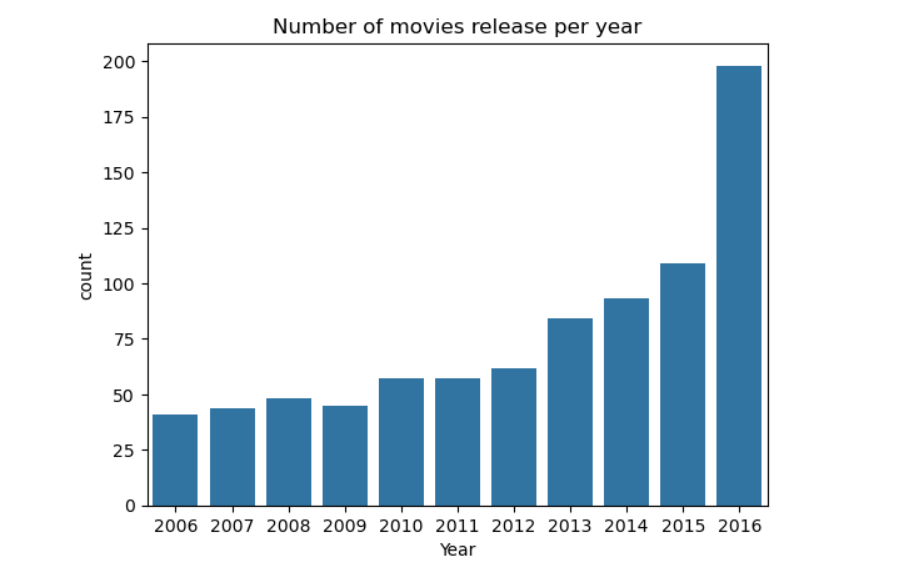

# IMDB Movie Analysis Project 🎬

A comprehensive data analysis project exploring movie trends, performance metrics, and industry insights using Python and pandas.

## 📊 Project Overview

This project analyzes an IMDB movie dataset containing **838 movies** to uncover patterns in the entertainment industry. The analysis focuses on data cleaning, exploratory data analysis, and visualization to derive actionable insights.

## 🔧 Technologies Used

- **Python** - Primary programming language
- **Pandas** - Data manipulation and analysis
- **NumPy** - Numerical computations
- **Matplotlib** - Data visualization
- **Seaborn** - Statistical data visualization
- **Jupyter Notebook** - Development environment

## 📈 Key Analyses Performed

### 1. Data Cleaning & Preparation
- Identified and handled missing values (Revenue: 128, Metascore: 64)
- Verified data integrity (no duplicate entries)
- Applied data cleaning techniques using `dropna()`

### 2. Exploratory Data Analysis
- **Temporal Analysis**: Year-wise voting patterns and trends
- **Runtime Analysis**: Identification of longest movies
- **Rating vs Revenue Correlation**: Relationship between ratings and box office success

## 🎯 Key Findings

- **Peak Engagement Year**: 2012 recorded highest average votes (290,861)
- **Longest Movie**: "The Hateful Eight" at 187 minutes
- **Rating-Revenue Relationship**: Comprehensive correlation analysis through scatter plots

## 📊 Project Visualizations

### Votes by Year Analysis


### Top 10 Highest Rating Movies


### Top 10 Longest Movies


### Highest Revenue by Year


### Rating vs Revenue Correlation


### Number of Movies Per Year


### Missing Values Heatmap


## 🚀 How to Run

1. **Clone the repository**
   ```bash
   git clone https://github.com/yourusername/imdb-movie-analysis.git
   cd imdb-movie-analysis
   ```

2. **Install required packages**
   ```bash
   pip install pandas numpy matplotlib seaborn jupyter
   ```

3. **Launch Jupyter Notebook**
   ```bash
   jupyter notebook
   ```

## 💡 Business Insights

- Understanding rating-revenue correlation guides investment decisions
- Year-wise trends help in release timing strategies
- Runtime preferences inform production planning

## 🔮 Future Enhancements

- Director Performance Analysis
- Genre-Specific Analysis
- Predictive Modeling for movie success
- Interactive dashboards using Plotly

## 📞 Contact

- **GitHub**: [Harshvspr](https://github.com/Harshvspr)
- **Email**: harshvs4002hs@gmail.com

---

⭐ **If you found this project helpful, please give it a star!** ⭐
